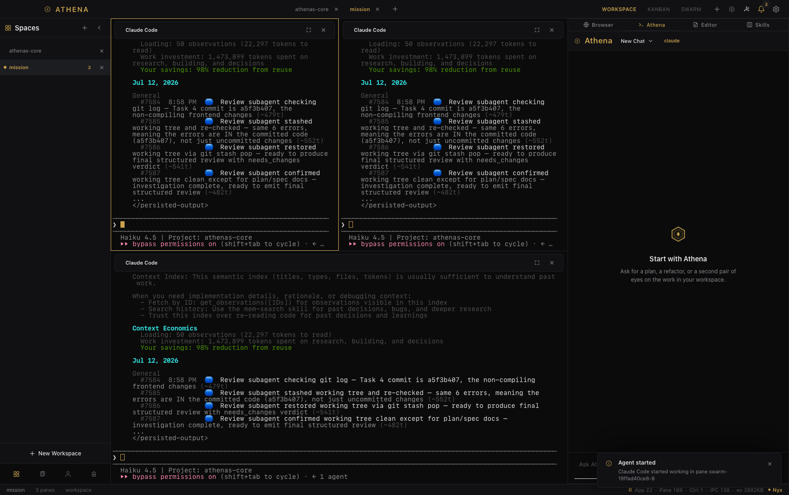
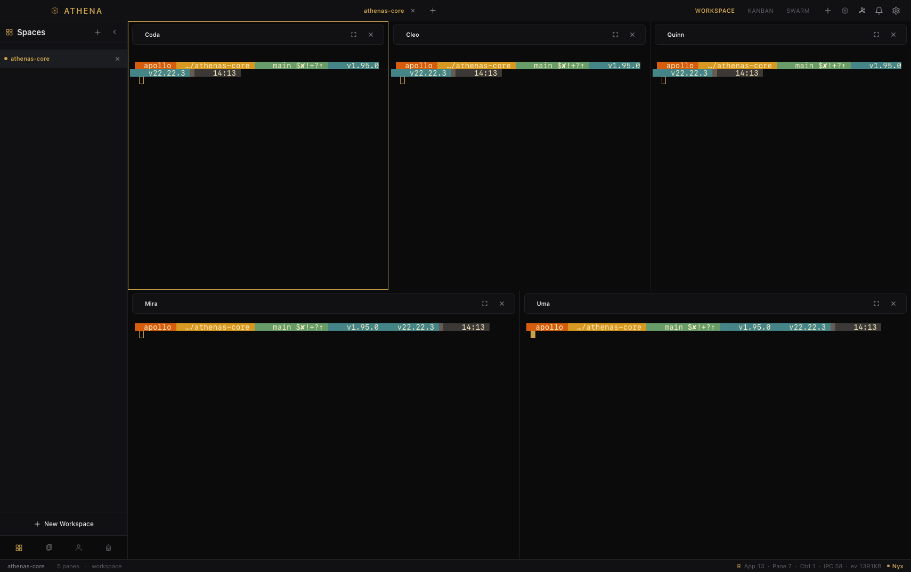
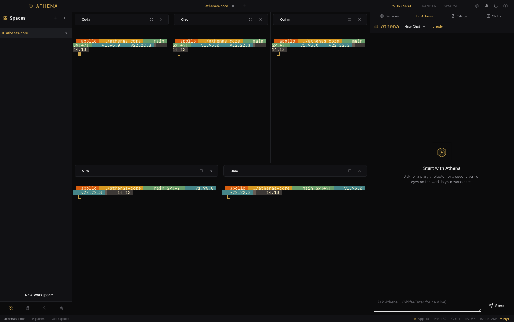
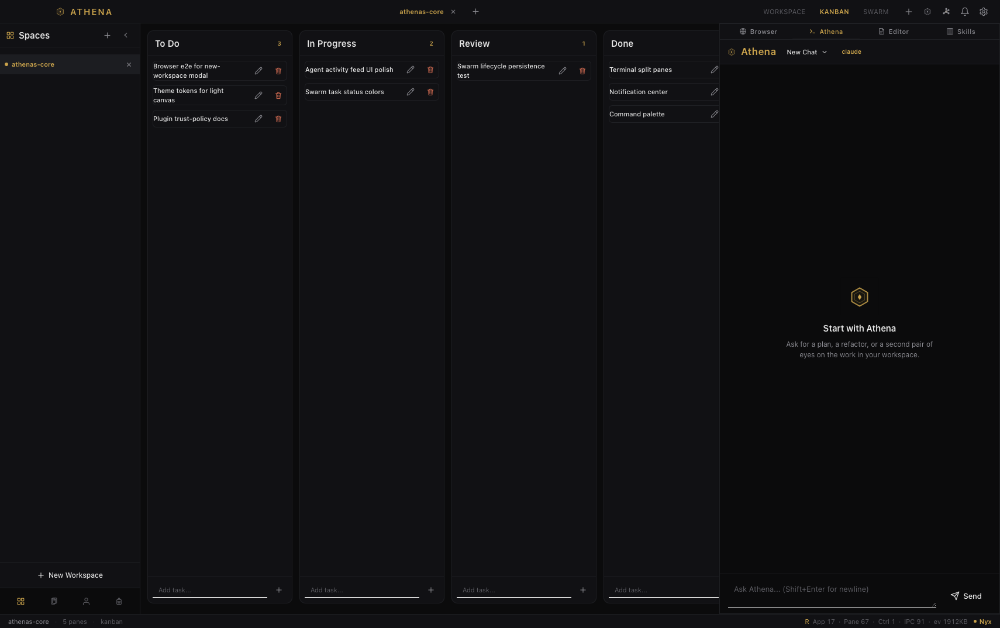
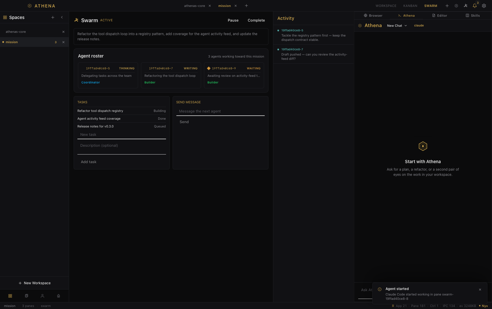

# Athena's Core


[](https://opensource.org/licenses/MIT)
[](https://github.com/TOX9C/athenas-core/releases)
[](https://www.rust-lang.org/)
[](https://github.com/TOX9C/athenas-core)
[](https://nowpayments.io/donation/tox9c)

**Athena's Core** is a native macOS workspace that puts your terminal, AI chat, task board, and agent team in a single window — so you stop switching between five apps to get one thing done.

<p align="center">
  
</p>

---

## What it does

- **Terminals, side by side** — run several shell sessions in one resizable grid.
- **An AI that knows your workspace** — chat with Claude, OpenAI, NVIDIA NIM, or local models, attach screenshots, and let Athena run commands, search your code, and manage your tasks.
- **A task board** — keep work in To Do → In Progress → In Review → Complete.
- **An agent team** — launch a swarm of agents that coordinate on a shared goal while you watch.
- **Everything else nearby** — an embedded browser, plugins, 16 themes, and notifications that keep you posted.

## Screenshots

| Your project, in one place | Chat with full context |
| --- | --- |
|  |  |

| See the next step | Put a team on it |
| --- | --- |
|  |  |

---

## Get it

**macOS 13+ on Apple Silicon.**

1. Open the [Releases](https://github.com/TOX9C/athenas-core/releases) page.
2. Download the latest `.dmg`.
3. Drag Athena's Core into **Applications** and launch.

## Keyboard shortcuts

| Shortcut                              | Action                        |
| ------------------------------------- | ----------------------------- |
| `Cmd+K` / `Cmd+P`                     | Show command palette          |
| `Cmd+J` / `Cmd+\`                     | Toggle right sidebar          |
| `Cmd+B`                               | Toggle left sidebar           |
| `Cmd+T`                               | New workspace                 |
| `Cmd+Shift+A`                         | Add shell pane                |
| `Cmd+Shift+S`                         | Launch swarm                  |
| `Cmd+1` / `Cmd+2` / `Cmd+3` / `Cmd+4` | Switch panels                 |
| `Cmd+,`                               | Open settings                 |
| `Cmd+W`                               | Close active pane             |
| `Escape`                              | Close modals / dismiss popups |

## Build from source

Prefer to build it yourself? Most people can just download the app, but if you want to contribute or hack on it:

```bash
git clone https://github.com/TOX9C/athenas-core
cd athenas-core

# Build the frontend assets (release mode)
bash frontend/build-dist.sh

# Run the app
cargo run --manifest-path src-tauri/Cargo.toml
```

See [`docs/development-guide.md`](docs/development-guide.md) for the full setup.

---

## Documentation

Everything else — architecture, plugin and MCP guides, contributing — lives in [`docs/`](docs/README.md).

## Privacy and support

Before you start connecting providers or sharing the app, take a look at the [Privacy Notice](docs/release/PRIVACY_NOTICE.md). If something goes wrong, the [Support Runbook](docs/release/SUPPORT_RUNBOOK.md) walks you through safe troubleshooting. And please never post API keys or credentials in an issue.

## License

Athena's Core is released under the [MIT License](LICENSE).

---

## Support the developer

Athena's Core is free and open source. If it saves you time or you just want to support a solo developer, donations are appreciated.

**Crypto:**

| Coin | Network | Address |
|------|---------|---------|
| BTC | Bitcoin | `bc1qn8ehwc7rxlpgvljztr5k6npqf307xq00dqatf8` |
| ETH / USDT / USDC | ERC-20 | `0x4260456e1dbdc880d69d75949726953215a93586` |
| USDT | TRC-20 | `TSBUpAreTjmUscbUbf4L1wkX1fvvJvSRGW` |

**Donate online (card or crypto):** https://nowpayments.io/donation/tox9c

**Other ways to help:**
- ⭐ Star the repo on [GitHub](https://github.com/TOX9C/athenas-core)
- Share it with friends or on social media
- Report bugs and suggest features in [Issues](https://github.com/TOX9C/athenas-core/issues)
- Contribute code via Pull Requests
